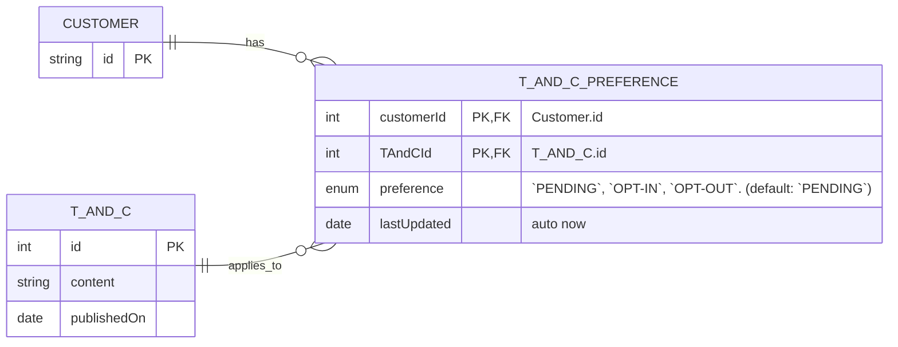
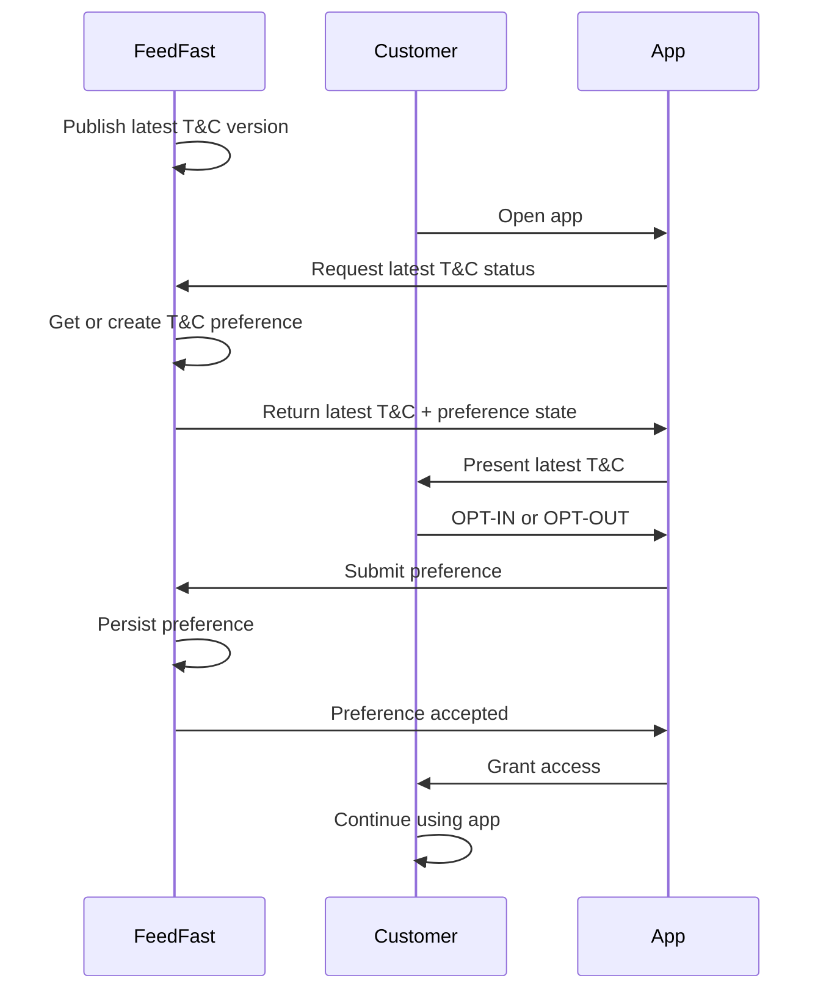

# PDPA Spec

## Background

While PDPA regulations are now in full force, FeedFast has not yet updated its consent management system to support what the PDPA mandates.

PDPA encompasses a number of things. In this context, the focus is exclusively on consent management. As a business, FeedFast must get users’ explicit opt-in or opt-out for each update of the T&C and ensure that they have consent for sending marketing communication.

You are asked to:

- Create an ERD that will be shared with the engineering team for final review and validation.
- Create a sample API spec using Postman to clearly communicate the needs and expectations to the engineering team.

## Approach

# Summary

- Customer records already exist in the system
- Whenever Customers are presented with new T&C's, a new `T_AND_C_PREFERENCE` record is created with `PENDING` status
- Customers can then opt-in or opt-out and their preference is persisted.

# Notes

- Other `CUSTOMER` fields omitted for brevity
- `T_AND_C_PREFERENCE` has a composite primary key formed from `customerId` and `TandCId`
- `T_AND_C.id` uses `int` for simple version ordering
- When a customer is first presented with a `T_AND_C` version, create a `T_AND_C_PREFERENCE` row with preference = `PENDING`
- When the customer submits a preference, update preference to either `OPT-IN` or `OPT-OUT`
- On delete of `T_AND_C`, `CASCADE` delete related `T_AND_C_PREFERENCE` rows
- On delete of `CUSTOMER`, `CASCADE` delete related `T_AND_C_PREFERENCE` rows

# Lifecycle

# Traps Avoided

- Storing preferences as `bool` – does `FALSE` mean `OPT-OUT` or `PENDING`?
- Creating `T_AND_C_PREFERENCE` on every publish of new T&C – causes huge fan-out per user.
