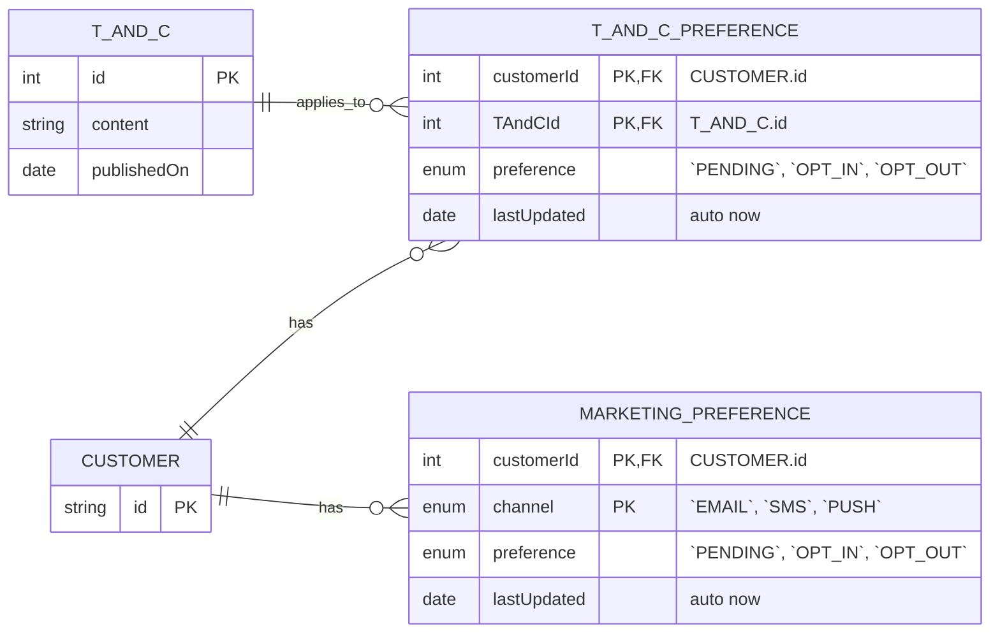

# PDPA Spec

## Background

While PDPA regulations are now in full force, FeedFast has not yet updated its consent management system to support what the PDPA mandates.

PDPA encompasses a number of things. In this context, the focus is exclusively on consent management. As a business, FeedFast must get users’ explicit opt-in or opt-out for each update of the T&C and ensure that they have consent for sending marketing communication.

You are asked to:

- Create an ERD that will be shared with the engineering team for final review and validation.
- Create a sample API spec using Postman to clearly communicate the needs and expectations to the engineering team.

## Approach

### Summary

- Customer records already exist in the system.
- Each published T&C version is stored in `T_AND_C`.
- When a customer is presented with a new T&C version, a `T_AND_C_PREFERENCE` record is created with `PENDING` status.
- The customer must explicitly choose `OPT_IN` or `OPT_OUT` before continuing.
- Marketing communication preferences are managed separately in `MARKETING_PREFERENCE`, per channel.
- T&C consent and marketing preferences are modelled separately due to different lifecycle and business rules.

### Entity-Relationship Diagram

#### Domain Rules

- A customer has one `T_AND_C_PREFERENCE` per T&C version.
- A customer has one `MARKETING_PREFERENCE` per channel.
- `PENDING` represents a T&C version that has been presented but not yet accepted or rejected.
- Customers must resolve `PENDING` before accessing core functionality.
- Marketing preferences are independent of T&C acceptance and can be updated at any time.

### Notes

- Other `CUSTOMER` fields are omitted for brevity.
- `T_AND_C_PREFERENCE` has a composite primary key of `customerId` + `TAndCId`.
- `MARKETING_PREFERENCE` has a composite primary key of `customerId` + `channel`.
- `T_AND_C.id` uses `int` for simple version ordering.
- A `T_AND_C_PREFERENCE` row is created when the T&C is presented to the customer.
- Initial state is `PENDING`, updated to `OPT_IN` or `OPT_OUT` on user action.
- On delete of `T_AND_C`, cascade delete related `T_AND_C_PREFERENCE` rows.
- On delete of `CUSTOMER`, cascade delete related preference rows.

#### Traps Avoided

- Storing preferences as `bool` — does `false` mean `OPT_OUT` or `PENDING`?
- Coupling marketing consent to T&C acceptance — they have different lifecycle rules.
- Creating preference rows for all users on T&C publish — instead created lazily on presentation – huge-fan-out.
